# DB-Schema-Entwurf

Dieser Entwurf beschreibt eine moegliche relationale Datenbank fuer das aktuelle Schulungs-ERP.
Er ist bewusst einfach gehalten und orientiert sich am aktuellen Mockup.

## 1. Vereinfachtes ER-Diagramm

```mermaid
erDiagram
    KUNDEN ||--o{ KUNDENANFRAGEN : stellt
    KUNDEN ||--o{ ANGEBOTE : erhaelt
    KUNDEN ||--o{ AUFTRAEGE : beauftragt
    KUNDEN ||--o{ REKLAMATIONEN : meldet

    KUNDENANFRAGEN ||--o{ NACHRICHTEN : hat
    KUNDENANFRAGEN ||--o| ANGEBOTE : fuehrt_zu
    KUNDENANFRAGEN ||--o| AUFTRAEGE : fuehrt_zu

    ANGEBOTE ||--o{ ANGEBOTSPOSITIONEN : hat
    ANGEBOTE ||--o{ NACHRICHTEN : betrifft
    ANGEBOTE ||--o| AUFTRAEGE : wird_zu

    AUFTRAEGE ||--o{ AUFTRAGSPOSITIONEN : hat
    AUFTRAEGE ||--o{ VERTRIEBSDOKUMENTE : hat
    AUFTRAEGE ||--o{ VERSANDAUFTRAEGE : hat
    AUFTRAEGE ||--o{ RECHNUNGEN : erzeugt
    AUFTRAEGE ||--o{ ZAHLUNGEN : hat
    AUFTRAEGE ||--o{ MAHNUNGEN : hat

    LIEFERANTEN ||--o{ BESTELLUNGEN : erhaelt
    BESTELLUNGEN ||--o{ BESTELLPOSITIONEN : hat
    BESTELLUNGEN ||--o{ EINKAUFSDOKUMENTE : hat
    BESTELLUNGEN ||--o{ RECHNUNGEN : erzeugt
    BESTELLUNGEN ||--o{ ZAHLUNGEN : hat

    ARTIKEL ||--o{ ANGEBOTSPOSITIONEN : wird_angeboten
    SERVICES ||--o{ ANGEBOTSPOSITIONEN : wird_angeboten
    ARTIKEL ||--o{ AUFTRAGSPOSITIONEN : wird_verkauft
    SERVICES ||--o{ AUFTRAGSPOSITIONEN : wird_verkauft
    ARTIKEL ||--o{ BESTELLPOSITIONEN : wird_bestellt

    ARTIKEL ||--o{ ARTIKEL_STUECKLISTE : hauptartikel
    ARTIKEL ||--o{ ARTIKEL_STUECKLISTE : komponentenartikel
    LAGER ||--o{ LAGERBESTAENDE : fuehrt
    ARTIKEL ||--o{ LAGERBESTAENDE : liegt_in

    MITARBEITER ||--o{ ARBEITSZEITEN : bucht
    MITARBEITER ||--o{ URLAUBSANTRAEGE : stellt
    MITARBEITER ||--o{ KRANKMELDUNGEN : meldet
    MITARBEITER ||--o{ PERSONALAKTEN : hat
    SCHULUNGEN ||--o{ SCHULUNG_TEILNEHMER : hat
    MITARBEITER ||--o{ SCHULUNG_TEILNEHMER : nimmt_teil

    ROLLEN ||--o{ BENUTZER : hat
    ROLLEN ||--o{ ROLLEN_RECHTE : enthaelt
    RECHTE ||--o{ ROLLEN_RECHTE : ordnet_zu
```



## 2. Kernidee

- `kunden`, `lieferanten`, `artikel`, `services` und `mitarbeiter` sind Stammdaten.
- `kundenanfragen`, `angebote`, `auftraege` und `bestellungen` bilden den Kernprozess.
- Positionen werden in eigene Tabellen ausgelagert.
- `nachrichten` haelt Verhandlungs- und Kommunikationsverlaeufe fest.
- `vertriebsdokumente` und `einkaufsdokumente` bleiben eigene didaktische Dokumenttabellen.
- `rechnungen`, `zahlungen` und `mahnungen` bilden eine einfache Offene-Posten-Logik ab.

## 3. SQL-Entwurf fuer PostgreSQL

```sql
create table kunden (
    id bigserial primary key,
    kunden_nr text not null unique,
    firma text not null,
    anschrift text,
    plz text,
    ort text,
    segment text,
    website text,
    notiz text
);

create table lieferanten (
    id bigserial primary key,
    lieferanten_nr text not null unique,
    firma text not null,
    anschrift text,
    plz text,
    ort text,
    segment text,
    fuer_btz boolean default false,
    bewertung numeric(4,2),
    favorit boolean default false,
    notiz text
);

create table artikel (
    id bigserial primary key,
    artikel_nr text not null unique,
    name text not null,
    kategorie text,
    artikel_typ text not null,
    einkaufspreis numeric(12,2),
    verkaufspreis numeric(12,2),
    bestand numeric(12,2) default 0,
    beschreibung text,
    ist_verkaufbar boolean default true
);

create table services (
    id bigserial primary key,
    service_nr text not null unique,
    name text not null,
    kategorie text,
    einkaufspreis numeric(12,2),
    verkaufspreis numeric(12,2),
    beschreibung text
);

create table lager (
    id bigserial primary key,
    name text not null,
    standort text,
    kapazitaet numeric(12,2)
);

create table lagerbestaende (
    id bigserial primary key,
    lager_id bigint not null references lager(id) on delete cascade,
    artikel_id bigint not null references artikel(id) on delete cascade,
    bestand numeric(12,2) not null default 0,
    unique (lager_id, artikel_id)
);

create table artikel_stueckliste (
    id bigserial primary key,
    hauptartikel_id bigint not null references artikel(id) on delete cascade,
    komponentenartikel_id bigint not null references artikel(id) on delete restrict,
    menge numeric(12,2) not null,
    unique (hauptartikel_id, komponentenartikel_id)
);

create table kundenanfragen (
    id bigserial primary key,
    vorgang_id text not null unique,
    typ text not null,
    kunde_id bigint not null references kunden(id) on delete restrict,
    kanal text,
    status text not null,
    datum date not null,
    anliegen text not null,
    angebot_id bigint,
    auftrag_id bigint
);

create table angebote (
    id bigserial primary key,
    vorgang_id text not null,
    angebots_nr text not null unique,
    angebots_basis_nr text not null,
    revision integer not null default 0,
    anfrage_id bigint references kundenanfragen(id) on delete set null,
    kunde_id bigint not null references kunden(id) on delete restrict,
    datum date not null,
    gueltig_bis date,
    status text not null,
    rabatt_betrag numeric(12,2) default 0,
    verguenstigungsgrund text,
    gesamtbetrag numeric(12,2) default 0
);

create table angebotspositionen (
    id bigserial primary key,
    angebot_id bigint not null references angebote(id) on delete cascade,
    artikel_id bigint references artikel(id) on delete set null,
    service_id bigint references services(id) on delete set null,
    bezeichnung text not null,
    positions_typ text not null,
    menge numeric(12,2) not null,
    einzelpreis numeric(12,2) not null,
    check (
        (artikel_id is not null and service_id is null)
        or (artikel_id is null and service_id is not null)
    )
);

create table auftraege (
    id bigserial primary key,
    auftrag_nr text not null unique,
    kunde_id bigint not null references kunden(id) on delete restrict,
    anfrage_id bigint references kundenanfragen(id) on delete set null,
    angebot_id bigint references angebote(id) on delete set null,
    datum date not null,
    status text not null,
    faellig_am date,
    notiz text
);

create table auftragspositionen (
    id bigserial primary key,
    auftrag_id bigint not null references auftraege(id) on delete cascade,
    artikel_id bigint references artikel(id) on delete set null,
    service_id bigint references services(id) on delete set null,
    bezeichnung text not null,
    positions_typ text not null,
    menge numeric(12,2) not null,
    einzelpreis numeric(12,2) not null,
    check (
        (artikel_id is not null and service_id is null)
        or (artikel_id is null and service_id is not null)
    )
);

create table vertriebsdokumente (
    id bigserial primary key,
    auftrag_id bigint not null references auftraege(id) on delete cascade,
    kunde_id bigint references kunden(id) on delete set null,
    dokument_typ text not null,
    titel text not null,
    datum date not null,
    status text not null,
    versendet_am date,
    notiz text
);

create table versandauftraege (
    id bigserial primary key,
    versand_nr text not null unique,
    auftrag_id bigint not null references auftraege(id) on delete cascade,
    datum date not null,
    status text not null,
    transport text,
    liefertermin date
);

create table reklamationen (
    id bigserial primary key,
    reklamations_nr text not null unique,
    kunde_id bigint not null references kunden(id) on delete restrict,
    auftrag_id bigint references auftraege(id) on delete set null,
    datum date not null,
    beschreibung text not null,
    status text not null
);

create table retouren (
    id bigserial primary key,
    retouren_nr text not null unique,
    kunde_id bigint references kunden(id) on delete set null,
    artikel_id bigint references artikel(id) on delete set null,
    datum date not null,
    status text not null,
    grund text
);

create table bestellungen (
    id bigserial primary key,
    bestell_nr text not null unique,
    lieferant_id bigint not null references lieferanten(id) on delete restrict,
    datum date not null,
    status text not null,
    wareneingang_am date,
    notiz text
);

create table bestellpositionen (
    id bigserial primary key,
    bestellung_id bigint not null references bestellungen(id) on delete cascade,
    artikel_id bigint references artikel(id) on delete set null,
    bezeichnung text not null,
    menge numeric(12,2) not null,
    einstandspreis numeric(12,2) not null
);

create table einkaufsdokumente (
    id bigserial primary key,
    bestellung_id bigint not null references bestellungen(id) on delete cascade,
    lieferant_id bigint references lieferanten(id) on delete set null,
    dokument_typ text not null,
    titel text not null,
    datum date not null,
    status text not null,
    versendet_am date,
    notiz text
);

create table rechnungen (
    id bigserial primary key,
    rechnungs_nr text not null unique,
    rechnungstyp text not null,
    auftrag_id bigint references auftraege(id) on delete set null,
    bestellung_id bigint references bestellungen(id) on delete set null,
    kunde_id bigint references kunden(id) on delete set null,
    lieferant_id bigint references lieferanten(id) on delete set null,
    datum date not null,
    faellig_am date,
    betrag numeric(12,2) not null,
    status text not null
);

create table zahlungen (
    id bigserial primary key,
    rechnung_id bigint references rechnungen(id) on delete set null,
    auftrag_id bigint references auftraege(id) on delete set null,
    bestellung_id bigint references bestellungen(id) on delete set null,
    zahlungsart text not null,
    datum date not null,
    ausfuehren_am date,
    betrag numeric(12,2) not null,
    methode text,
    status text not null
);

create table mahnungen (
    id bigserial primary key,
    rechnung_id bigint not null references rechnungen(id) on delete cascade,
    datum date not null,
    status text not null,
    stufe text not null,
    notiz text
);

create table belege (
    id bigserial primary key,
    beleg_typ text not null,
    bezug_typ text,
    bezug_id bigint,
    datum date,
    status text,
    beschreibung text
);

create table firmenkonto (
    id bigserial primary key,
    datum date not null,
    betreff text not null,
    info text,
    soll numeric(12,2) default 0,
    haben numeric(12,2) default 0,
    saldo numeric(12,2) default 0
);

create table bewerber (
    id bigserial primary key,
    name text not null,
    stelle text,
    datum date,
    status text not null,
    notiz text
);

create table mitarbeiter (
    id bigserial primary key,
    name text not null,
    abteilung text,
    rolle text,
    eintritt date,
    status text
);

create table arbeitszeiten (
    id bigserial primary key,
    mitarbeiter_id bigint not null references mitarbeiter(id) on delete cascade,
    datum date not null,
    von_uhrzeit time,
    bis_uhrzeit time,
    status text not null
);

create table urlaubsantraege (
    id bigserial primary key,
    mitarbeiter_id bigint not null references mitarbeiter(id) on delete cascade,
    von date not null,
    bis date not null,
    tage numeric(6,2),
    status text not null
);

create table krankmeldungen (
    id bigserial primary key,
    mitarbeiter_id bigint not null references mitarbeiter(id) on delete cascade,
    von date not null,
    bis date not null,
    grund text,
    status text not null
);

create table schulungen (
    id bigserial primary key,
    titel text not null,
    zielgruppe text,
    datum date,
    status text,
    ort text
);

create table schulung_teilnehmer (
    id bigserial primary key,
    schulung_id bigint not null references schulungen(id) on delete cascade,
    mitarbeiter_id bigint not null references mitarbeiter(id) on delete cascade,
    unique (schulung_id, mitarbeiter_id)
);

create table personalakten (
    id bigserial primary key,
    mitarbeiter_id bigint not null references mitarbeiter(id) on delete cascade,
    dokument_typ text not null,
    titel text not null,
    datum date,
    status text,
    notiz text
);

create table marketingaktionen (
    id bigserial primary key,
    typ text not null,
    titel text not null,
    datum date,
    status text,
    beschreibung text
);

create table abteilungen (
    id bigserial primary key,
    kuerzel text not null unique,
    name text not null,
    zuordnung text
);

create table freigaben (
    id bigserial primary key,
    titel text not null,
    bereich text,
    status text not null,
    verantwortung text,
    datum date,
    bezug text,
    notiz text
);

create table berichte (
    id bigserial primary key,
    titel text not null,
    bereich text,
    datum date,
    status text,
    zusammenfassung text,
    zielgruppe text,
    empfohlene_aktion text
);

create table rechte (
    id bigserial primary key,
    name text not null unique,
    beschreibung text
);

create table rollen (
    id bigserial primary key,
    name text not null unique,
    beschreibung text
);

create table rollen_rechte (
    rolle_id bigint not null references rollen(id) on delete cascade,
    recht_id bigint not null references rechte(id) on delete cascade,
    primary key (rolle_id, recht_id)
);

create table benutzer (
    id bigserial primary key,
    username text not null unique,
    email text unique,
    password_hash text not null,
    rolle_id bigint references rollen(id) on delete set null,
    aktiv boolean default true
);

create table nachrichten (
    id bigserial primary key,
    vorgang_id text not null,
    anfrage_id bigint references kundenanfragen(id) on delete set null,
    angebot_id bigint references angebote(id) on delete set null,
    datum date not null,
    zeitpunkt timestamp not null,
    sender_rolle text not null,
    sender_name text,
    kanal text,
    betreff text,
    nachricht text not null,
    typ text
);
```

## 4. Was ich fuer spaeter empfehlen wuerde

- `status`-Werte spaeter per `check` oder kleine Status-Tabellen vereinheitlichen.
- `belege` optional polymorph lassen oder spaeter spezialisieren.
- `firmenkonto` als didaktische Sondertabelle getrennt halten.
- `vertriebsdokumente` und `einkaufsdokumente` fuer das Schulungsziel ruhig separat lassen.
- `nachrichten` unbedingt behalten, weil damit Angebotsverhandlungen sehr gut nachvollziehbar werden.

## 5. Minimaler Start fuer eine echte DB

Wenn du klein anfangen willst, reichen zuerst:

- `kunden`
- `lieferanten`
- `artikel`
- `services`
- `kundenanfragen`
- `angebote`
- `angebotspositionen`
- `auftraege`
- `auftragspositionen`
- `bestellungen`
- `bestellpositionen`
- `nachrichten`

Damit bekommst du Einkauf, Verkauf und den aktuellen Verhandlungsprozess schon sehr gut in eine echte Datenbank.
