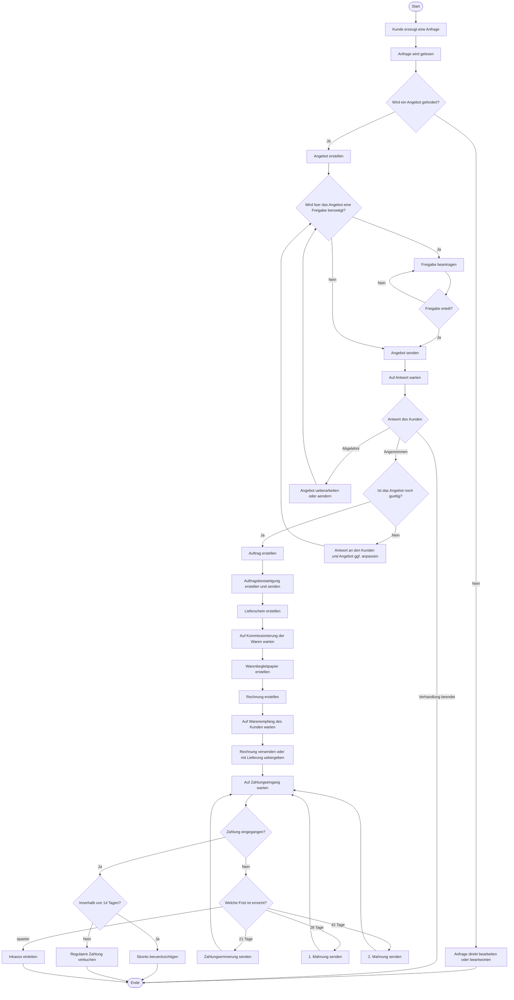

# Programmablaufplan ab Kundenanfrage

Dieses Dokument beschreibt den vollstaendigen Ablauf ab einer Kundenanfrage bis zum Zahlungseingang beziehungsweise bis zum Mahn- und Inkassoprozess.
Die Reihenfolge orientiert sich an der gewuenschten fachlichen Abfolge im Projekt.
## Programmablaufplan

## Schrittfolge

1. Start
2. Kunde erzeugt eine Anfrage.
3. Die Anfrage wird gelesen.
4. Falls ein Angebot gefordert wird, wird ein Angebot erstellt.
5. Wenn fuer das Angebot eine Freigabe benoetigt wird, wird eine Freigabe beantragt.
6. Nach Freigabeerteilung wird das Angebot gesendet und der Ablauf geht weiter zu Schritt 7.
7. Wenn keine Freigabe benoetigt wird, wird das Angebot direkt gesendet.
8. Danach wird auf die Antwort des Kunden gewartet.
9. Je nach Antwort gibt es drei Wege:
10. Angenommen: Zuerst wird geprueft, ob das Angebot noch gueltig ist.
11. Wenn das Angebot noch gueltig ist, geht es weiter mit der Auftragserstellung.
12. Wenn das Angebot nicht mehr gueltig ist, wird eine Antwort an den Kunden geschickt und das Angebot gegebenenfalls angepasst.
13. Danach geht der Vorgang zurueck in den Freigabe- oder Sendeprozess.
14. Abgelehnt: Angebot ueberarbeiten oder aendern und dann zurueck in den Freigabe- oder Sendeprozess.
15. Verhandlung beendet: Der Vorgang endet.
16. Auftrag erstellen.
17. Auftragsbestaetigung erstellen und senden.
18. Lieferschein erstellen.
19. Auf Kommissionierung der Waren warten.
20. Warenbegleitpapier erstellen.
21. Rechnung erstellen.
22. Auf Warenempfang des Kunden warten, zum Beispiel nachweisbar ueber ein Warenbegleitpapier.
23. Rechnung versenden oder bei Kauf auf Rechnung mit der Lieferung uebergeben.
24. Auf den Zahlungseingang warten.
25. Bis 14 Tage ist Skonto moeglich.
26. Bei 21 Tagen wird eine Zahlungserinnerung versendet.
27. Ab 28 Tagen folgt die 1. Mahnung.
28. Etwa 2 Wochen spaeter folgt die 2. Mahnung.
29. Danach kann der Vorgang an Inkasso uebergeben werden.

## Entscheidungslogik

- Angebotsbedarf:
  - Wenn kein Angebot benoetigt wird, kann die Anfrage direkt bearbeitet oder beantwortet werden.
  - Wenn ein Angebot benoetigt wird, startet der Angebotsprozess.

- Freigabe:
  - Angebote mit Freigabepflicht werden erst nach Freigabe versendet.
  - Angebote ohne Freigabepflicht werden direkt versendet.

- Angebotsantwort:
  - `angenommen` fuehrt zuerst zur Pruefung, ob das Angebot noch gueltig ist.
  - Ist das Angebot noch gueltig, wird ein Auftrag erstellt.
  - Ist das Angebot nicht mehr gueltig, geht eine Antwort an den Kunden und das Angebot wird gegebenenfalls angepasst.
  - `abgelehnt` fuehrt zur Ueberarbeitung des Angebots und anschliessend zurueck in den Freigabe- oder Sendeprozess.
  - `beendet` beendet die Verhandlung ohne Auftrag.

- Zahlung:
  - Zahlung innerhalb von 14 Tagen kann mit Skonto verarbeitet werden.
  - Bleibt die Zahlung aus, startet die Erinnerungs- und Mahnfolge.

## Bezug zum Mockup

- `kundenanfragen`: Startpunkt des Prozesses
- `angebote`: Angebotsphase mit Status wie `in Vorbereitung`, `wartet auf Antwort`, `angenommen`, `abgelehnt`, `beendet`
- `auftraege`: Folgeobjekt nach angenommener Angebotsphase
- `vertriebsdokumente`: Auftragsbestaetigung, Lieferschein und Warenbegleitpapier
- `rechnungen` und `zahlungen`: Zahlungsueberwachung
- `mahnungen`: Eskalation bei ausbleibender Zahlung
